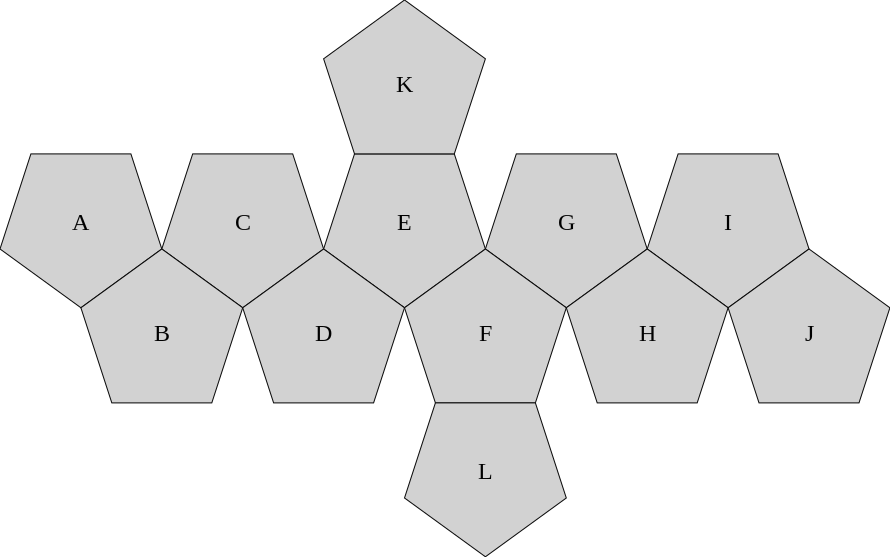

## Extended Golay Error Correction Code

### Construction

Extended binary Golay code is an error correcting code that takes 12 bits of data and encodes them in 24 bits so that any 3-bit error can be corrected. Encoding is performed by multiplying the input bit vector by the following generator matrix:

|   | A | B | C | D | E | F | G | H | I | J | K | L | A | B | C | D | E | F | G | H | I | J | K | L |
|---|---|---|---|---|---|---|---|---|---|---|---|---|---|---|---|---|---|---|---|---|---|---|---|---|
| A | 1 | 0 | 0 | 0 | 0 | 0 | 0 | 0 | 0 | 0 | 0 | 0 | 1 | 0 | 0 | 1 | 1 | 1 | 1 | 1 | 0 | 0 | 0 | 1 |
| B | 0 | 1 | 0 | 0 | 0 | 0 | 0 | 0 | 0 | 0 | 0 | 0 | 0 | 1 | 0 | 0 | 1 | 1 | 1 | 1 | 1 | 0 | 1 | 0 |
| C | 0 | 0 | 1 | 0 | 0 | 0 | 0 | 0 | 0 | 0 | 0 | 0 | 0 | 0 | 1 | 0 | 0 | 1 | 1 | 1 | 1 | 1 | 0 | 1 |
| D | 0 | 0 | 0 | 1 | 0 | 0 | 0 | 0 | 0 | 0 | 0 | 0 | 1 | 0 | 0 | 1 | 0 | 0 | 1 | 1 | 1 | 1 | 1 | 0 |
| E | 0 | 0 | 0 | 0 | 1 | 0 | 0 | 0 | 0 | 0 | 0 | 0 | 1 | 1 | 0 | 0 | 1 | 0 | 0 | 1 | 1 | 1 | 0 | 1 |
| F | 0 | 0 | 0 | 0 | 0 | 1 | 0 | 0 | 0 | 0 | 0 | 0 | 1 | 1 | 1 | 0 | 0 | 1 | 0 | 0 | 1 | 1 | 1 | 0 |
| G | 0 | 0 | 0 | 0 | 0 | 0 | 1 | 0 | 0 | 0 | 0 | 0 | 1 | 1 | 1 | 1 | 0 | 0 | 1 | 0 | 0 | 1 | 0 | 1 |
| H | 0 | 0 | 0 | 0 | 0 | 0 | 0 | 1 | 0 | 0 | 0 | 0 | 1 | 1 | 1 | 1 | 1 | 0 | 0 | 1 | 0 | 0 | 1 | 0 |
| I | 0 | 0 | 0 | 0 | 0 | 0 | 0 | 0 | 1 | 0 | 0 | 0 | 0 | 1 | 1 | 1 | 1 | 1 | 0 | 0 | 1 | 0 | 0 | 1 |
| J | 0 | 0 | 0 | 0 | 0 | 0 | 0 | 0 | 0 | 1 | 0 | 0 | 0 | 0 | 1 | 1 | 1 | 1 | 1 | 0 | 0 | 1 | 1 | 0 |
| K | 0 | 0 | 0 | 0 | 0 | 0 | 0 | 0 | 0 | 0 | 1 | 0 | 0 | 1 | 0 | 1 | 0 | 1 | 0 | 1 | 0 | 1 | 1 | 1 |
| L | 0 | 0 | 0 | 0 | 0 | 0 | 0 | 0 | 0 | 0 | 0 | 1 | 1 | 0 | 1 | 0 | 1 | 0 | 1 | 0 | 1 | 0 | 1 | 1 |

The left half of the matrix does nothing (first 12 output bits are the same as input bits). The interesting part is the right half, called _parity_ or _checksum_ matrix, with the following hexadecimal representation:

    static constexpr unsigned const golay_matrix_[] = {
      0x9f1, 0x4fa, 0x27d, 0x93e, 0xc9d, 0xe4e,
      0xf25, 0xf92, 0x7c9, 0x3e6, 0x557, 0xaab
    };

Wikipedia description of the construction of the checksum matrix is a bit terse: [A generator matrix for the binary Golay code is *I* *A*, where *I* is the 12×12 identity matrix, and *A* is the complement of the adjacency matrix of the icosahedron](https://en.wikipedia.org/wiki/Binary_Golay_code#Constructions "Wikipedia description of Golay code construction process"). It is easier to explain with a picture. 

Take a regular dodecahedron and label its faces from *A* to *L*, as shown below. It's easier to mark faces than vertices, and dodecahedron is a dual of icosahedron, so we can do that. The picture is flattened to show all faces at the same time, but you can imagine cutting it out and folding to form the dodecahedron.

Each face corresponds to one input bit. To get one checksum (parity) bit, take corresponding face and all faces that are not adjacent to it. For example, for face *E* (checksum bit column marked *E*), that would be faces *A*, *B*, *E*, *H*, *I*, *J*, and *L*, because faces *C*, *D*, *F*, *G*, and *K* share an edge with *E*.

### Implementation

[golay.h](golay.h) file contains a brute force implementation of class `GolayCode` with two methods, `encode` and `decode`.

### Example

Usage:

    golay filename

Adds extended Golay code checksum bits to the file, then splits it in 8 slices named `filename.Golay_A`, `filename.Golay_B`, ..., `filename_Golay_H`.

If filename ends in `.Golay_A`, performs the decoding and recreates the original file from the slices.

Up to 3 bit errors in a 24 bit codeword can be corrected. Each slice has 3 bits from any codeword, therefore the original file can be restored even when one of the 8 slices is completely missing, as long as there are no other errors.

When called without arguments, shows usage and runs a self-test.
